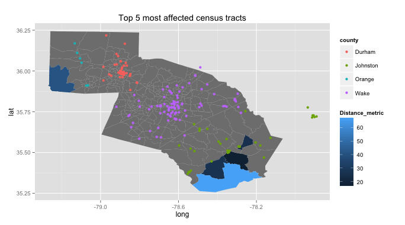

## Measuring the Distance People in Need Travel to Food Pantries
</br>

*How far do people in need travel to food pantries?*  

#### Problem/Question  

Tasked with exploring the data surrounding the issue of child hunger in North Carolina, we decided to analyze the distance of the food pantries from the people in need. For the purpose of this analysis, we focused on Durham, Johnston, Orange, and Wake Counties in North Carolina. On a census tract level, we gathered information from the American Community Survey about the population: the total number of households, the percentage of households receiving food stamps, the percentage of households with children under 18 years, the percentage of households with children under 18 years receiving foods stamps, and other such categories. In addition, we had received data regarding the food pantries that claimed to serve the four counties on which we were focusing. Combining these two sets of information, we proceeded by calculating the distance from the center of each of these census tracts to the individual food pantries. 

</br>

#### Visualization

##### Food Pantry Locations
```{r, echo = FALSE, warning=FALSE}
library(leaflet)
m=leaflet()
m=addTiles(m)

pantries = read.delim("./pantries.csv",sep=",",header=T,stringsAsFactors=F)
m$width = 652
m$height = 652
m <- setView(m, lng = -78.5, lat = 35.75, zoom = 10)
m <- fitBounds(m, lng1 = -79.26835,lat1 =  35.25638, lng2 = -78.06460, lat2 = 36.24387)
m <- addMarkers(m, lng=pantries$lon, lat=pantries$lat, popup=pantries$foodpantry)
m
```
</br>
  
</br>
We would recommend (1) investigating further the two census tracts that were identified as having a large number of households receiving food stamps but not much access to food pantries, and (2) looking to see if there are other locations, such as grocery stores or farmers’ markets, from which households could Easily access low-cost food. 

</br>

#### Future Work

Based on our results, we would recommend further investigating those two census plots that contain both a larger number of households that received food stamps as well as a further distance to travel. Future research could also include sub-setting only the population that receives food stamps and has children under the age of 18. Additionally, we would recommend looking into those households that receive WIC and SNAP in order to determine the distance of these recipients from the food pantries. You might also consider looking into additional locations of acquiring food, such as feeding sights (for children in the summer) and grocery stores or farmers markets. 

</br>

#### Sources

[Food Pantries](http://drzeydy.github.io/Data4Good/foodpantries.html)  
[2013 ACS Table S2201](http://math-and-data.github.io/Data4Good/Census-ACS.html)  
[NC Census Tract Shapefile](http://math-and-data.github.io/Data4Good/Census-Shapefiles.html)  

</br>

#### Contributors

Rita Bennett-Chew  
Sarah Gauby  
Shariq Iqbal  
Erica Levine  
Bharathkumar Ramachandra  
Suzy Stiegelmeyer  

</br>
